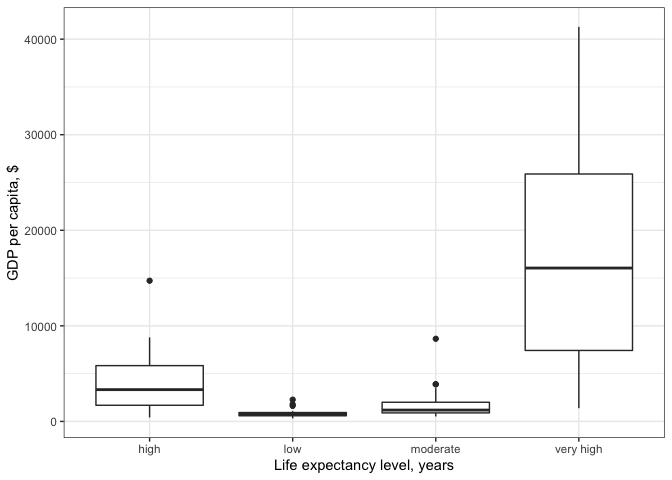
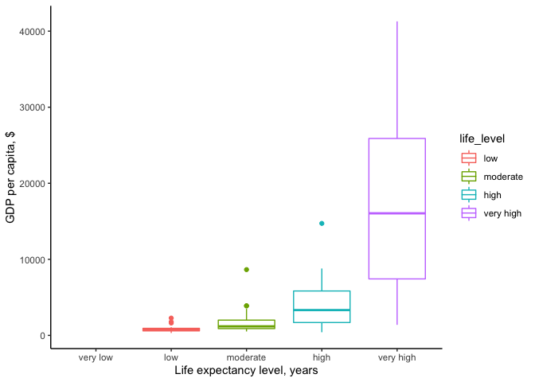
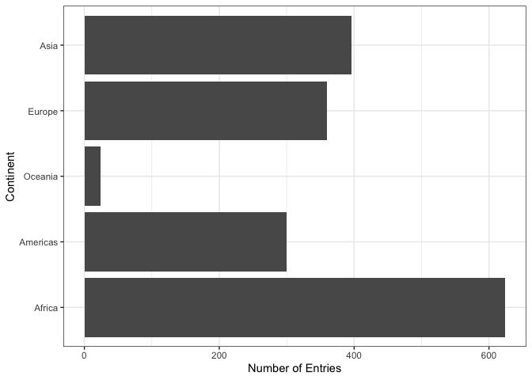
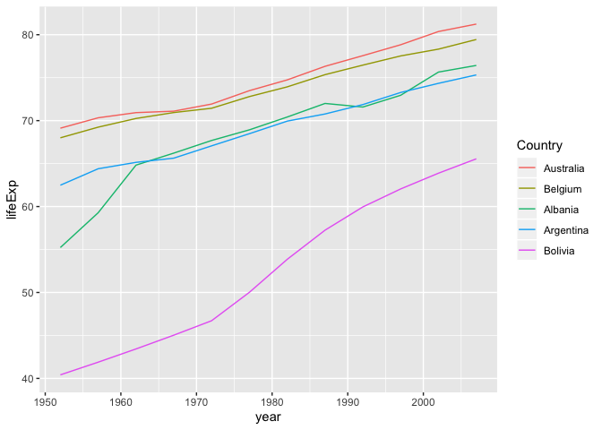

## Class Work-Flow:

---


**Looking at life expectancy by row:**

  * less than 23 ---> assigning the outcome to "Very Low" for the newly created variable. 


```text
gapminder %>% 
  filter(year == 1997) %>% 
  mutate(life_level = case_when(lifeExp < 23 ~ 'very low',
                                lifeExp < 48 ~ 'low',
                                lifeExp < 59 ~ 'moderate',
                                lifeExp < 70 ~ 'high',
                                # else
                                TRUE ~ 'very high')) %>% 
  ggplot() + geom_boxplot(aes(x = life_level, y = gdpPercap)) +
  labs(y = "GDP per capita, $", x = "Life expectancy level, years") +
  theme_bw() 
```

<!-- -->

**More plotting:**

```text
gapminder %>% 
  filter(year == 1997) %>% 
  mutate(life_level = factor(case_when(lifeExp < 23 ~ 'very low',
                                  lifeExp < 48 ~ 'low',
                                  lifeExp < 59 ~ 'moderate',
                                  lifeExp < 70 ~ 'high',
                                  # else
                                  TRUE ~ 'very high'),
                        levels = c("very low", "low", "moderate", "high", "very high"))) %>%  
  ggplot() + 
  geom_boxplot(aes(x = life_level, y = gdpPercap, color=life_level)) +
  labs(y = "GDP per capita, $", x = "Life expectancy level, years") +
  scale_x_discrete(drop = FALSE) +
  theme_classic()
```

<!-- -->


**Subsetting gapminder by specific countries:**

  * Note: If you want to drop levels b/c with no matching values, you can use 'droplevels' instead (see example below)

```text
five_country <- gapminder %>% 
  filter(country %in% c("Albania", "Argentina", "Australia", "Belgium", "Bolivia"))
nlevels(five_country$country) 
```

```
## [1] 142
```

_Dropping levels here_

```text
five_country_drop <- five_country %>% 
  droplevels()
```

```text
nlevels(five_country_drop$country) #now we only have 5 levels instead of 142
## [1] 5
```


Some more practice with plotting

```text
gapminder %>%
  ggplot() +
  geom_bar(aes(continent)) +
  coord_flip() +
  theme_bw() +
  ylab("Number of entries") + xlab("Continent")
```

<!-- -->


```text
gapminder %>%
  ggplot() +
  geom_bar(aes(fct_infreq(continent))) + #in order of frequency 
  coord_flip() +
  theme_bw() +
  ylab("Number of entries") + xlab("Continent")
```

<!-- -->

```text
#fct_inorder() in order of appearance
#fct_inseq() in order of underlying integers
#fct_rev() in opposite order
```

**Ordering by life expectancy:**

```text
gapminder %>%
  ggplot() +
  geom_bar(aes(fct_reorder(continent, lifeExp, max))) + #add 'fct_reorder'
  coord_flip() +
  theme_bw() +
  xlab("Continent") + ylab("Number of Entries") 
```

<!-- -->

**Color-coding relationship between two quant variables by country**

```text
ggplot(five_country, aes(x = year, y = lifeExp,
                  color = fct_reorder2(country, year, lifeExp))) +
  geom_line() + labs(color = "Country")
```

<!-- -->


**More practice with filtering certain countries with certain years:**

  * Dropping levels in this example too

```text
# US & Mexico Only with years greater than 2000 
df1 <- gapminder %>%
  filter(country %in% c("United States", "Mexico"), year > 2000) %>%
  droplevels()

df2 <- gapminder %>%
  filter(country %in% c("France", "Germany"), year > 2000) %>%
  droplevels()
c(df1$country, df2$country)
```

```
## [1] 1 1 2 2 1 1 2 2
```

```text
fct_c(df1$country, df2$country)
```

```
## [1] Mexico        Mexico        United States United States France       
## [6] France        Germany       Germany      
## Levels: Mexico United States France Germany
```
