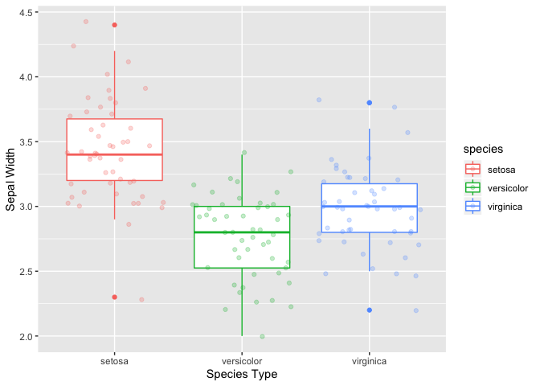
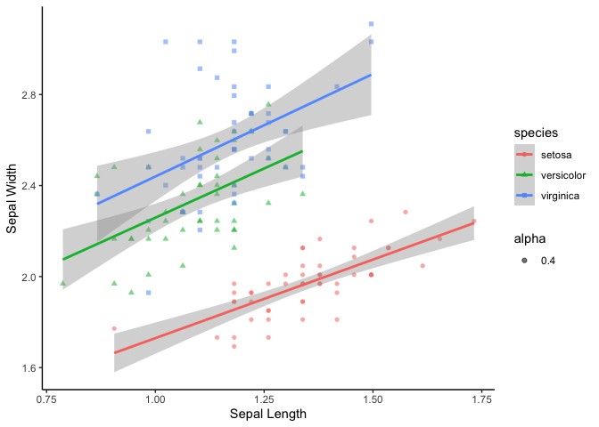
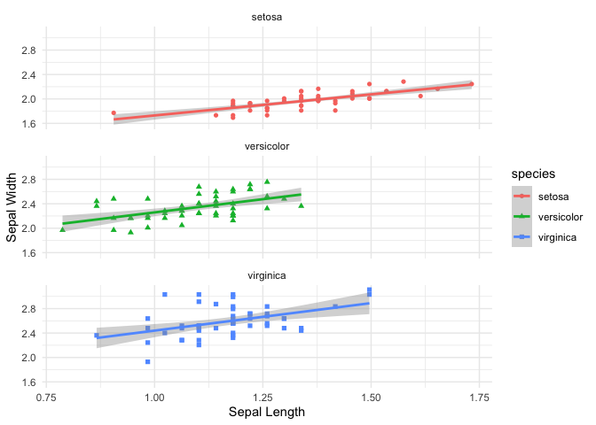

**When you make an Rmd file for participation or homework, be sure to do this**:

1. Change the file output to both html and md _documents_ (not notebook).
  - See the `keep_md: TRUE` argument above.

2. `knit` the document. 

3. Stage and commit the Rmd and knitted documents.


# Let's review some `dplyr` syntax

Load the `tidyverse` package.
    


## `select()`, `rename()`, `filter()`, `mutate()`, and a little plotting

Let's use the `mtcars` dataset. Complete the following tasks. Chain together
all of the commands in a task using the pipe `%>%`.

1. Show the miles per gallon and horsepower for cars with 6 cylinders. Also
   convert the data frame to a tibble (keep the rownames and store them in the
   tibble with a descriptive variable name). Store this result as a new object
   with a descriptive object name.


```r
results<- mtcars %>% 
  rownames_to_column(var="Vehicle") %>% 
  filter(cyl == 6) %>% 
  select(mpg, hp, Vehicle) 

results
```

```
##    mpg  hp        Vehicle
## 1 21.0 110      Mazda RX4
## 2 21.0 110  Mazda RX4 Wag
## 3 21.4 110 Hornet 4 Drive
## 4 18.1 105        Valiant
## 5 19.2 123       Merc 280
## 6 17.8 123      Merc 280C
## 7 19.7 175   Ferrari Dino
```


2. Print the results from Task 1 in an appealing way by using `knitr::kable()`.


```r
knitr::kable(results, caption = "Cars and Stuff", align = "c")
```


Table: Cars and Stuff

 mpg     hp        Vehicle     
------  -----  ----------------
 21.0    110      Mazda RX4    
 21.0    110    Mazda RX4 Wag  
 21.4    110    Hornet 4 Drive 
 18.1    105       Valiant     
 19.2    123       Merc 280    
 17.8    123      Merc 280C    
 19.7    175     Ferrari Dino  


Let's use the `iris` dataset. Complete the following tasks. Chain together
all of the commands in a task using the pipe `%>%`.

3. Rename the variables to be all lowercase and to separate words with "_"
   instead of ".". Put the species name variable first. Store this result as 
   a new object.


```r
names(iris)
```

```
## [1] "Sepal.Length" "Sepal.Width"  "Petal.Length" "Petal.Width"  "Species"
```

```r
names(iris)<- c("sepal_length", "sepal_width",
                "petal_length","petal_width", "species")
#stringr::string_replace_all()
```

Put species variable name first:

```r
iris %>% 
  select(species, everything()) 
```

```
##        species sepal_length sepal_width petal_length petal_width
## 1       setosa          5.1         3.5          1.4         0.2
## 2       setosa          4.9         3.0          1.4         0.2
## 3       setosa          4.7         3.2          1.3         0.2
## 4       setosa          4.6         3.1          1.5         0.2
## 5       setosa          5.0         3.6          1.4         0.2
## 6       setosa          5.4         3.9          1.7         0.4
## 7       setosa          4.6         3.4          1.4         0.3
## 8       setosa          5.0         3.4          1.5         0.2
## 9       setosa          4.4         2.9          1.4         0.2
## 10      setosa          4.9         3.1          1.5         0.1
## 11      setosa          5.4         3.7          1.5         0.2
## 12      setosa          4.8         3.4          1.6         0.2
## 13      setosa          4.8         3.0          1.4         0.1
## 14      setosa          4.3         3.0          1.1         0.1
## 15      setosa          5.8         4.0          1.2         0.2
## 16      setosa          5.7         4.4          1.5         0.4
## 17      setosa          5.4         3.9          1.3         0.4
## 18      setosa          5.1         3.5          1.4         0.3
## 19      setosa          5.7         3.8          1.7         0.3
## 20      setosa          5.1         3.8          1.5         0.3
## 21      setosa          5.4         3.4          1.7         0.2
## 22      setosa          5.1         3.7          1.5         0.4
## 23      setosa          4.6         3.6          1.0         0.2
## 24      setosa          5.1         3.3          1.7         0.5
## 25      setosa          4.8         3.4          1.9         0.2
## 26      setosa          5.0         3.0          1.6         0.2
## 27      setosa          5.0         3.4          1.6         0.4
## 28      setosa          5.2         3.5          1.5         0.2
## 29      setosa          5.2         3.4          1.4         0.2
## 30      setosa          4.7         3.2          1.6         0.2
## 31      setosa          4.8         3.1          1.6         0.2
## 32      setosa          5.4         3.4          1.5         0.4
## 33      setosa          5.2         4.1          1.5         0.1
## 34      setosa          5.5         4.2          1.4         0.2
## 35      setosa          4.9         3.1          1.5         0.2
## 36      setosa          5.0         3.2          1.2         0.2
## 37      setosa          5.5         3.5          1.3         0.2
## 38      setosa          4.9         3.6          1.4         0.1
## 39      setosa          4.4         3.0          1.3         0.2
## 40      setosa          5.1         3.4          1.5         0.2
## 41      setosa          5.0         3.5          1.3         0.3
## 42      setosa          4.5         2.3          1.3         0.3
## 43      setosa          4.4         3.2          1.3         0.2
## 44      setosa          5.0         3.5          1.6         0.6
## 45      setosa          5.1         3.8          1.9         0.4
## 46      setosa          4.8         3.0          1.4         0.3
## 47      setosa          5.1         3.8          1.6         0.2
## 48      setosa          4.6         3.2          1.4         0.2
## 49      setosa          5.3         3.7          1.5         0.2
## 50      setosa          5.0         3.3          1.4         0.2
## 51  versicolor          7.0         3.2          4.7         1.4
## 52  versicolor          6.4         3.2          4.5         1.5
## 53  versicolor          6.9         3.1          4.9         1.5
## 54  versicolor          5.5         2.3          4.0         1.3
## 55  versicolor          6.5         2.8          4.6         1.5
## 56  versicolor          5.7         2.8          4.5         1.3
## 57  versicolor          6.3         3.3          4.7         1.6
## 58  versicolor          4.9         2.4          3.3         1.0
## 59  versicolor          6.6         2.9          4.6         1.3
## 60  versicolor          5.2         2.7          3.9         1.4
## 61  versicolor          5.0         2.0          3.5         1.0
## 62  versicolor          5.9         3.0          4.2         1.5
## 63  versicolor          6.0         2.2          4.0         1.0
## 64  versicolor          6.1         2.9          4.7         1.4
## 65  versicolor          5.6         2.9          3.6         1.3
## 66  versicolor          6.7         3.1          4.4         1.4
## 67  versicolor          5.6         3.0          4.5         1.5
## 68  versicolor          5.8         2.7          4.1         1.0
## 69  versicolor          6.2         2.2          4.5         1.5
## 70  versicolor          5.6         2.5          3.9         1.1
## 71  versicolor          5.9         3.2          4.8         1.8
## 72  versicolor          6.1         2.8          4.0         1.3
## 73  versicolor          6.3         2.5          4.9         1.5
## 74  versicolor          6.1         2.8          4.7         1.2
## 75  versicolor          6.4         2.9          4.3         1.3
## 76  versicolor          6.6         3.0          4.4         1.4
## 77  versicolor          6.8         2.8          4.8         1.4
## 78  versicolor          6.7         3.0          5.0         1.7
## 79  versicolor          6.0         2.9          4.5         1.5
## 80  versicolor          5.7         2.6          3.5         1.0
## 81  versicolor          5.5         2.4          3.8         1.1
## 82  versicolor          5.5         2.4          3.7         1.0
## 83  versicolor          5.8         2.7          3.9         1.2
## 84  versicolor          6.0         2.7          5.1         1.6
## 85  versicolor          5.4         3.0          4.5         1.5
## 86  versicolor          6.0         3.4          4.5         1.6
## 87  versicolor          6.7         3.1          4.7         1.5
## 88  versicolor          6.3         2.3          4.4         1.3
## 89  versicolor          5.6         3.0          4.1         1.3
## 90  versicolor          5.5         2.5          4.0         1.3
## 91  versicolor          5.5         2.6          4.4         1.2
## 92  versicolor          6.1         3.0          4.6         1.4
## 93  versicolor          5.8         2.6          4.0         1.2
## 94  versicolor          5.0         2.3          3.3         1.0
## 95  versicolor          5.6         2.7          4.2         1.3
## 96  versicolor          5.7         3.0          4.2         1.2
## 97  versicolor          5.7         2.9          4.2         1.3
## 98  versicolor          6.2         2.9          4.3         1.3
## 99  versicolor          5.1         2.5          3.0         1.1
## 100 versicolor          5.7         2.8          4.1         1.3
## 101  virginica          6.3         3.3          6.0         2.5
## 102  virginica          5.8         2.7          5.1         1.9
## 103  virginica          7.1         3.0          5.9         2.1
## 104  virginica          6.3         2.9          5.6         1.8
## 105  virginica          6.5         3.0          5.8         2.2
## 106  virginica          7.6         3.0          6.6         2.1
## 107  virginica          4.9         2.5          4.5         1.7
## 108  virginica          7.3         2.9          6.3         1.8
## 109  virginica          6.7         2.5          5.8         1.8
## 110  virginica          7.2         3.6          6.1         2.5
## 111  virginica          6.5         3.2          5.1         2.0
## 112  virginica          6.4         2.7          5.3         1.9
## 113  virginica          6.8         3.0          5.5         2.1
## 114  virginica          5.7         2.5          5.0         2.0
## 115  virginica          5.8         2.8          5.1         2.4
## 116  virginica          6.4         3.2          5.3         2.3
## 117  virginica          6.5         3.0          5.5         1.8
## 118  virginica          7.7         3.8          6.7         2.2
## 119  virginica          7.7         2.6          6.9         2.3
## 120  virginica          6.0         2.2          5.0         1.5
## 121  virginica          6.9         3.2          5.7         2.3
## 122  virginica          5.6         2.8          4.9         2.0
## 123  virginica          7.7         2.8          6.7         2.0
## 124  virginica          6.3         2.7          4.9         1.8
## 125  virginica          6.7         3.3          5.7         2.1
## 126  virginica          7.2         3.2          6.0         1.8
## 127  virginica          6.2         2.8          4.8         1.8
## 128  virginica          6.1         3.0          4.9         1.8
## 129  virginica          6.4         2.8          5.6         2.1
## 130  virginica          7.2         3.0          5.8         1.6
## 131  virginica          7.4         2.8          6.1         1.9
## 132  virginica          7.9         3.8          6.4         2.0
## 133  virginica          6.4         2.8          5.6         2.2
## 134  virginica          6.3         2.8          5.1         1.5
## 135  virginica          6.1         2.6          5.6         1.4
## 136  virginica          7.7         3.0          6.1         2.3
## 137  virginica          6.3         3.4          5.6         2.4
## 138  virginica          6.4         3.1          5.5         1.8
## 139  virginica          6.0         3.0          4.8         1.8
## 140  virginica          6.9         3.1          5.4         2.1
## 141  virginica          6.7         3.1          5.6         2.4
## 142  virginica          6.9         3.1          5.1         2.3
## 143  virginica          5.8         2.7          5.1         1.9
## 144  virginica          6.8         3.2          5.9         2.3
## 145  virginica          6.7         3.3          5.7         2.5
## 146  virginica          6.7         3.0          5.2         2.3
## 147  virginica          6.3         2.5          5.0         1.9
## 148  virginica          6.5         3.0          5.2         2.0
## 149  virginica          6.2         3.4          5.4         2.3
## 150  virginica          5.9         3.0          5.1         1.8
```


4. Using the data from Task 3, plot the sepal width for each species. Perhaps 
   use a boxplot or a jitter plot (or both overlaid!). Be sure to format the
   axis labels nicely.


```r
ggplot(iris, aes(x= species, y=sepal_width, color=species)) +
  geom_boxplot() +
  geom_jitter(alpha=.25) +
  labs(x= "Species Type", y="Sepal Width")
```

<!-- -->


5. `iris` expresses all of the measurements in centimeters. Convert them to 
   inches (1 in = 2.54 cm). Store this dataset as a new object.


```r
new.iris<- iris %>%
  mutate_if(is.numeric, ~ (.x / 2.54))
```


6. Using the data from Task 5, plot the relationship between sepal width and
   sepal length. Indicate species using color and point shape.


```r
ggplot(new.iris, aes(x=sepal_width, y=sepal_length, color=species)) +
  geom_point(aes(shape=species, alpha=.4)) +
  geom_smooth(method="lm") + labs(x="Sepal Length", y="Sepal Width") +
  theme_classic()
```

<!-- -->


7. Using the data from Task 5, plot the relationship between sepal width and
   sepal length. This time, separate each species into a different subplot 
   (facet).


```r
ggplot(new.iris, aes(x=sepal_width, y=sepal_length, color=species)) +
  geom_point(aes(shape=species)) +
  geom_smooth(method="lm") + labs(x="Sepal Length", y="Sepal Width") +
  facet_wrap(~species, nrow = 3) +
  theme_minimal()
```




# Back to Guide Again

Let's head back to the guide at the section on `summarize()`.


# Exercises for grouped data frames

Let's do some practice with grouping (and ungrouping) and summarizing data frames!

1. (a) What's the minimum life expectancy for each continent and each year? 
   (b) Add the corresponding country to the tibble, too. 
   (c) Arrange by min life expectancy.


  - Group_by will ignore all other groups; computes everything separately for each group. Don't confuse group by with arrange, is not re-ordering the rows - just grouping the dataset accordingly. 

  
__mutate() either changes an existing column or adds a new one. summarise() calculates a single value (per group)!!!!!!!!__
  
Wrong:

```r
gapminder %>% 
  as_tibble() %>% 
  group_by(continent, year) %>% 
  mutate(min_life = min(lifeExp)) %>% 
  select(continent, year, country, min_life) %>% arrange(min_life)
```

```
## # A tibble: 1,704 x 4
## # Groups:   continent, year [60]
##    continent  year country                  min_life
##    <fct>     <int> <fct>                       <dbl>
##  1 Africa     1992 Algeria                      23.6
##  2 Africa     1992 Angola                       23.6
##  3 Africa     1992 Benin                        23.6
##  4 Africa     1992 Botswana                     23.6
##  5 Africa     1992 Burkina Faso                 23.6
##  6 Africa     1992 Burundi                      23.6
##  7 Africa     1992 Cameroon                     23.6
##  8 Africa     1992 Central African Republic     23.6
##  9 Africa     1992 Chad                         23.6
## 10 Africa     1992 Comoros                      23.6
## # … with 1,694 more rows
```

Right:

  * However, getting country back into the tibble is still a mystery...

```r
gapminder %>% 
  select(continent, year, country, lifeExp) %>% 
  group_by(continent, year) %>% 
  summarise(min_life = min(lifeExp))
```

```
## # A tibble: 60 x 3
## # Groups:   continent [5]
##    continent  year min_life
##    <fct>     <int>    <dbl>
##  1 Africa     1952     30  
##  2 Africa     1957     31.6
##  3 Africa     1962     32.8
##  4 Africa     1967     34.1
##  5 Africa     1972     35.4
##  6 Africa     1977     36.8
##  7 Africa     1982     38.4
##  8 Africa     1987     39.9
##  9 Africa     1992     23.6
## 10 Africa     1997     36.1
## # … with 50 more rows
```


u
2. Let's compute the mean Agreeableness score across items for each participant 
in the `psych::bfi` dataset. Be sure to handle `NA`!


```r
psych::bfi %>% 
  rownames_to_column(var = "id") %>%  #UNIQUE ID 
  as_tibble() %>% 
  select(id, A1:A5, C1:C5) %>% 
  rowwise() %>% 
  mutate(A_mean = mean(c(A1, A2, A3, A4, A5), na.rm = TRUE)) %>% 
  mutate(C_mean = mean(c(C1, C2, C3, C4, C5), na.rm = TRUE)) %>% 
  ungroup()
```

```
## # A tibble: 2,800 x 13
##    id       A1    A2    A3    A4    A5    C1    C2    C3    C4    C5 A_mean
##    <chr> <int> <int> <int> <int> <int> <int> <int> <int> <int> <int>  <dbl>
##  1 61617     2     4     3     4     4     2     3     3     4     4    3.4
##  2 61618     2     4     5     2     5     5     4     4     3     4    3.6
##  3 61620     5     4     5     4     4     4     5     4     2     5    4.4
##  4 61621     4     4     6     5     5     4     4     3     5     5    4.8
##  5 61622     2     3     3     4     5     4     4     5     3     2    3.4
##  6 61623     6     6     5     6     5     6     6     6     1     3    5.6
##  7 61624     2     5     5     3     5     5     4     4     2     3    4  
##  8 61629     4     3     1     5     1     3     2     4     2     4    2.8
##  9 61630     4     3     6     3     3     6     6     3     4     5    3.8
## 10 61633     2     5     6     6     5     6     5     6     2     1    4.8
## # … with 2,790 more rows, and 1 more variable: C_mean <dbl>
```

Now compute mean scores for Conscientiousness, as well as `sd` and `min` scores 
for each person.


```r
psych::bfi %>%
  as_tibble() %>% 
  select(A1:A5) %>% 
  rowwise() %>% 
  mutate(A_mean = mean(c(A1, A2, A3, A4, A5), na.rm = TRUE),
         A_sd = sd(c(A1, A2, A3, A4, A5), na.rm = TRUE),
         A_min = min(c(A1, A2, A3, A4, A5), na.rm = TRUE)) %>%
  select(A_mean, A_sd, A_min, everything()) %>%
  ungroup() 
```

```
## # A tibble: 2,800 x 8
##    A_mean  A_sd A_min    A1    A2    A3    A4    A5
##     <dbl> <dbl> <int> <int> <int> <int> <int> <int>
##  1    3.4 0.894     2     2     4     3     4     4
##  2    3.6 1.52      2     2     4     5     2     5
##  3    4.4 0.548     4     5     4     5     4     4
##  4    4.8 0.837     4     4     4     6     5     5
##  5    3.4 1.14      2     2     3     3     4     5
##  6    5.6 0.548     5     6     6     5     6     5
##  7    4   1.41      2     2     5     5     3     5
##  8    2.8 1.79      1     4     3     1     5     1
##  9    3.8 1.30      3     4     3     6     3     3
## 10    4.8 1.64      2     2     5     6     6     5
## # … with 2,790 more rows
```


Some functions are **vectorized**, so you don't need `rowwise()`. 
For example, `pmin()` computes the "parallel min" across the vectors it receives:


```r
psych::bfi %>% 
  as_tibble() %>% 
  select(A1:A5) %>% 
  mutate(A_min = pmin(A1, A2, A3, A4, A5))
```

```
## # A tibble: 2,800 x 6
##       A1    A2    A3    A4    A5 A_min
##    <int> <int> <int> <int> <int> <int>
##  1     2     4     3     4     4     2
##  2     2     4     5     2     5     2
##  3     5     4     5     4     4     4
##  4     4     4     6     5     5     4
##  5     2     3     3     4     5     2
##  6     6     6     5     6     5     5
##  7     2     5     5     3     5     2
##  8     4     3     1     5     1     1
##  9     4     3     6     3     3     3
## 10     2     5     6     6     5     2
## # … with 2,790 more rows
```


**There are a few other ways to do this sort of computation.**

`rowMeans()` computes the mean of each row of a data frame. We can use it by
putting `select()` inside of `mutate()`:


```r
psych::bfi %>% 
  as_tibble() %>% 
  select(A1:A5) %>% 
  mutate(A_mn = rowMeans(select(., A1:A5)),
         A_mn2 = rowMeans(select(., starts_with("A", ignore.case = FALSE))))
```

```
## # A tibble: 2,800 x 7
##       A1    A2    A3    A4    A5  A_mn A_mn2
##    <int> <int> <int> <int> <int> <dbl> <dbl>
##  1     2     4     3     4     4   3.4   3.4
##  2     2     4     5     2     5   3.6   3.6
##  3     5     4     5     4     4   4.4   4.4
##  4     4     4     6     5     5   4.8   4.8
##  5     2     3     3     4     5   3.4   3.4
##  6     6     6     5     6     5   5.6   5.6
##  7     2     5     5     3     5   4     4  
##  8     4     3     1     5     1   2.8   2.8
##  9     4     3     6     3     3   3.8   3.8
## 10     2     5     6     6     5   4.8   4.8
## # … with 2,790 more rows
```


**In the development version of `dplyr`, there are some functions to make**
**this approach easier.**

```
remotes::install_github("tidyverse/dplyr")
```


```r
psych::bfi %>% 
  as_tibble() %>% 
  select(A1:A5) %>% 
  mutate(A_mn = rowMeans(across(A1:A5)),
         A_mn2 = rowMeans(across(starts_with("A", ignore.case = FALSE))))
```


3. Let's use `psych::bfi` and make a new data frame that has
   (1) each participant's educational level (convert it to a categorical variable using `factor*()`) and the mean score for each of the Big Five scales for each participant. Store this data frame as a new object.
   

```r
bfi$education<- factor(bfi$education) #or can add this below in the tibble
```

```r
new.psych<-psych::bfi %>% 
  mutate(education = factor(education)) %>%
  mutate(A_mn = rowMeans(select(., A1:A5),na.rm = TRUE)) %>% 
                mutate(N_mn = rowMeans(select(., N1:N5),na.rm = TRUE)) %>% 
                mutate(O_mn = rowMeans(select(., O1:O5),na.rm = TRUE)) %>% 
                mutate(C_mn = rowMeans(select(., C1:C5),na.rm = TRUE)) %>% 
                mutate(E_mn = rowMeans(select(., E1:E5),na.rm = TRUE)) %>% 
  select(education, A_mn, N_mn, O_mn, C_mn, E_mn)
```


4. Use the data from Task 3 to summarize the distributions of Big Five scores 
   for each educational level (e.g., report the mean, sd, min, and max for
   each score in each group). Also report the sample size within each group.
   

```r
new.psych %>% 
  group_by(education) %>% 
  summarise(mean = mean(2:6),
            sd = sd(2:6),
            min = min(2:6),
            max = max(2:6),
            n = length(education))
```

```
## Warning: Factor `education` contains implicit NA, consider using
## `forcats::fct_explicit_na`
```

```
## # A tibble: 6 x 6
##   education  mean    sd   min   max     n
##   <fct>     <dbl> <dbl> <int> <int> <int>
## 1 1             4  1.58     2     6   224
## 2 2             4  1.58     2     6   292
## 3 3             4  1.58     2     6  1249
## 4 4             4  1.58     2     6   394
## 5 5             4  1.58     2     6   418
## 6 <NA>          4  1.58     2     6   223
```

```r
# better way to see distributions by each level of education
describeBy(new.psych, group=new.psych$education)
```

```
## 
##  Descriptive statistics by group 
## group: 1
##            vars   n mean   sd median trimmed  mad min max range  skew kurtosis
## education*    1 224 1.00 0.00    1.0    1.00 0.00 1.0 1.0   0.0   NaN      NaN
## A_mn          2 224 4.16 0.78    4.2    4.20 0.59 1.8 6.0   4.2 -0.40     0.26
## N_mn          3 224 3.26 1.21    3.2    3.24 1.30 1.0 6.0   5.0  0.12    -0.76
## O_mn          4 224 3.85 0.52    3.8    3.86 0.59 2.4 5.5   3.1 -0.07     0.21
## C_mn          5 224 3.80 0.62    3.8    3.80 0.59 1.6 5.5   3.9 -0.13     0.29
## E_mn          6 224 3.74 0.54    3.8    3.72 0.59 2.4 5.2   2.8  0.21    -0.31
##              se
## education* 0.00
## A_mn       0.05
## N_mn       0.08
## O_mn       0.03
## C_mn       0.04
## E_mn       0.04
## ------------------------------------------------------------ 
## group: 2
##            vars   n mean   sd median trimmed  mad  min max range  skew kurtosis
## education*    1 292 2.00 0.00    2.0    2.00 0.00 2.00 2.0  0.00   NaN      NaN
## A_mn          2 292 4.28 0.76    4.4    4.33 0.89 2.00 6.0  4.00 -0.57     0.05
## N_mn          3 292 3.23 1.28    3.2    3.21 1.48 1.00 6.0  5.00  0.15    -0.82
## O_mn          4 292 3.89 0.57    3.8    3.89 0.30 1.75 5.4  3.65 -0.14     0.90
## C_mn          5 292 3.83 0.57    3.8    3.83 0.59 1.80 5.6  3.80 -0.07     0.36
## E_mn          6 292 3.81 0.55    3.8    3.80 0.59 1.80 5.4  3.60  0.04     0.45
##              se
## education* 0.00
## A_mn       0.04
## N_mn       0.07
## O_mn       0.03
## C_mn       0.03
## E_mn       0.03
## ------------------------------------------------------------ 
## group: 3
##            vars    n mean   sd median trimmed  mad min max range  skew kurtosis
## education*    1 1249 3.00 0.00    3.0    3.00 0.00   3 3.0   0.0   NaN      NaN
## A_mn          2 1249 4.33 0.71    4.4    4.37 0.59   1 6.0   5.0 -0.70     1.05
## N_mn          3 1249 3.13 1.20    3.0    3.09 1.48   1 6.0   5.0  0.26    -0.65
## O_mn          4 1249 3.89 0.58    3.8    3.88 0.59   1 6.0   5.0  0.00     1.23
## C_mn          5 1249 3.78 0.56    3.8    3.79 0.59   1 6.0   5.0 -0.26     1.25
## E_mn          6 1249 3.82 0.56    3.8    3.82 0.59   1 5.8   4.8 -0.09     1.73
##              se
## education* 0.00
## A_mn       0.02
## N_mn       0.03
## O_mn       0.02
## C_mn       0.02
## E_mn       0.02
## ------------------------------------------------------------ 
## group: 4
##            vars   n mean   sd median trimmed  mad min max range  skew kurtosis
## education*    1 394 4.00 0.00    4.0    4.00 0.00 4.0 4.0   0.0   NaN      NaN
## A_mn          2 394 4.08 0.70    4.2    4.12 0.59 1.4 5.8   4.4 -0.55     0.30
## N_mn          3 394 3.06 1.18    3.0    3.03 1.19 1.0 6.0   5.0  0.26    -0.59
## O_mn          4 394 3.84 0.51    3.8    3.82 0.30 2.6 5.8   3.2  0.41     0.84
## C_mn          5 394 3.82 0.56    3.8    3.81 0.59 2.0 5.8   3.8  0.09     0.29
## E_mn          6 394 3.77 0.49    3.8    3.78 0.30 2.2 5.2   3.0 -0.07     0.30
##              se
## education* 0.00
## A_mn       0.04
## N_mn       0.06
## O_mn       0.03
## C_mn       0.03
## E_mn       0.02
## ------------------------------------------------------------ 
## group: 5
##            vars   n mean   sd median trimmed  mad min max range  skew kurtosis
## education*    1 418 5.00 0.00    5.0    5.00 0.00 5.0 5.0   0.0   NaN      NaN
## A_mn          2 418 4.16 0.66    4.2    4.21 0.59 1.6 6.0   4.4 -0.76     0.95
## N_mn          3 418 3.06 1.11    3.0    3.04 1.19 1.0 6.0   5.0  0.22    -0.56
## O_mn          4 418 3.89 0.49    4.0    3.88 0.59 2.4 5.6   3.2  0.23     0.76
## C_mn          5 418 3.86 0.53    3.8    3.88 0.59 2.0 5.4   3.4 -0.25     0.42
## E_mn          6 418 3.79 0.53    3.8    3.77 0.44 2.2 5.2   3.0  0.20     0.20
##              se
## education* 0.00
## A_mn       0.03
## N_mn       0.05
## O_mn       0.02
## C_mn       0.03
## E_mn       0.03
```


# Bonus Exercises

1. In `gapminder`, take all countries in Europe that have a GDP per capita 
   greater than 10000, and select all variables except `gdpPercap`. 
   (Hint: use `-`).

2. Take the first three columns of `gapminder` and extract the names.

3. In `gapminder`, convert the population to a number in billions.

4. Take the `iris` data frame and extract all columns that start with 
   the word "Petal". 
    - Hint: take a look at the "Select helpers" documentation by running the 
      following code: `?tidyselect::select_helpers`.

5. Filter the rows of `iris` for Sepal.Length >= 4.6 and Petal.Width >= 0.5.

6. Calculate the growth in population since the first year on record 
_for each country_ by rearranging the following lines, and filling in the 
`FILL_THIS_IN`. Here's another convenience function for you: `dplyr::first()`. 

```
mutate(rel_growth = FILL_THIS_IN) %>% 
arrange(FILL_THIS_IN) %>% 
gapminder %>% 
knitr::kable()
group_by(country) %>% 
```


7. Determine the country, on each continent, that experienced the 
**sharpest 5-year drop in life expectancy**, sorted by the drop, by rearranging 
the following lines of code. Ensure there are no `NA`'s. A helpful function to 
compute changes in a variable across rows of data (e.g., for time-series data) 
is `tsibble::difference()`:

```
drop_na() %>% 
ungroup() %>% 
arrange(year) %>% 
filter(inc_life_exp == min(inc_life_exp)) %>% 
gapminder %>% 
mutate(inc_life_exp = FILL_THIS_IN) %>% # Compute the changes in life expectancy
arrange(inc_life_exp) %>% 
group_by(country) %>% 
group_by(continent) %>% 
knitr::kable()
```


Exercises 4. and 5. are from 
[r-exercises](https://www.r-exercises.com/2017/10/19/dplyr-basic-functions-exercises/).
